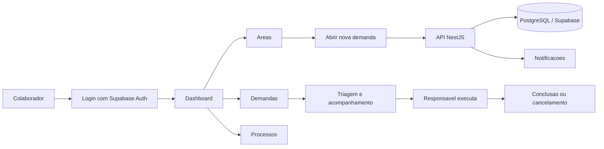
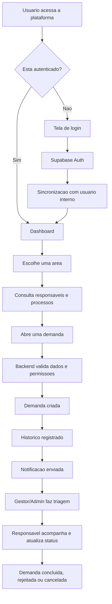
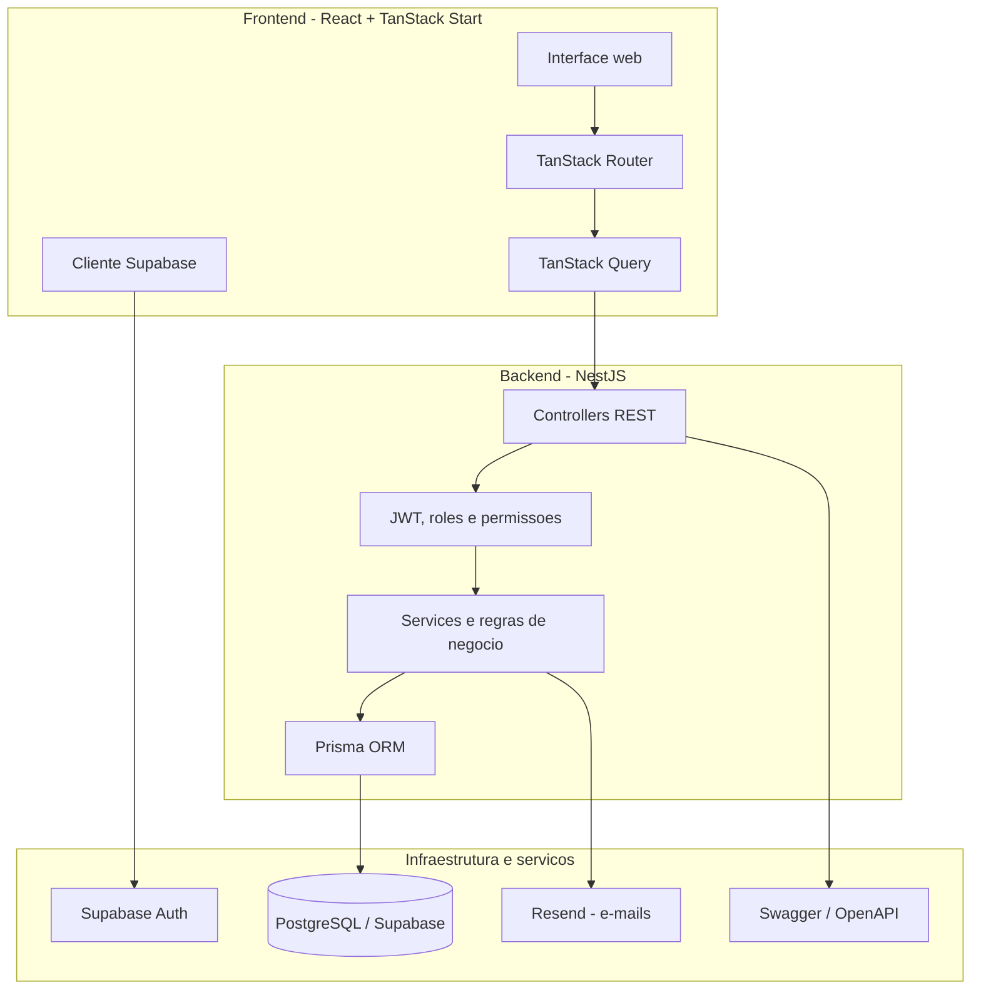
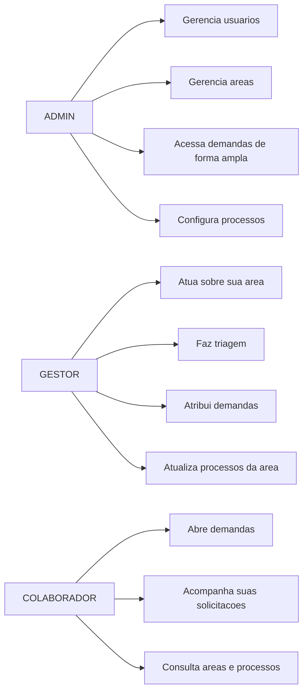
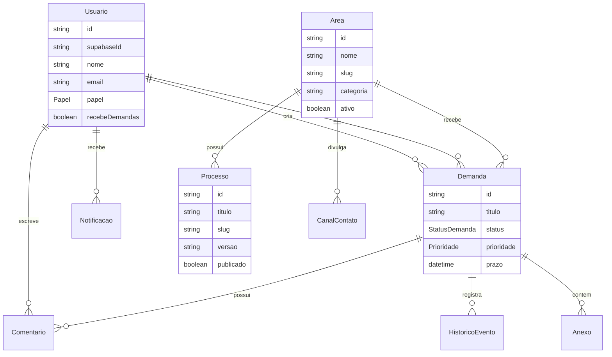
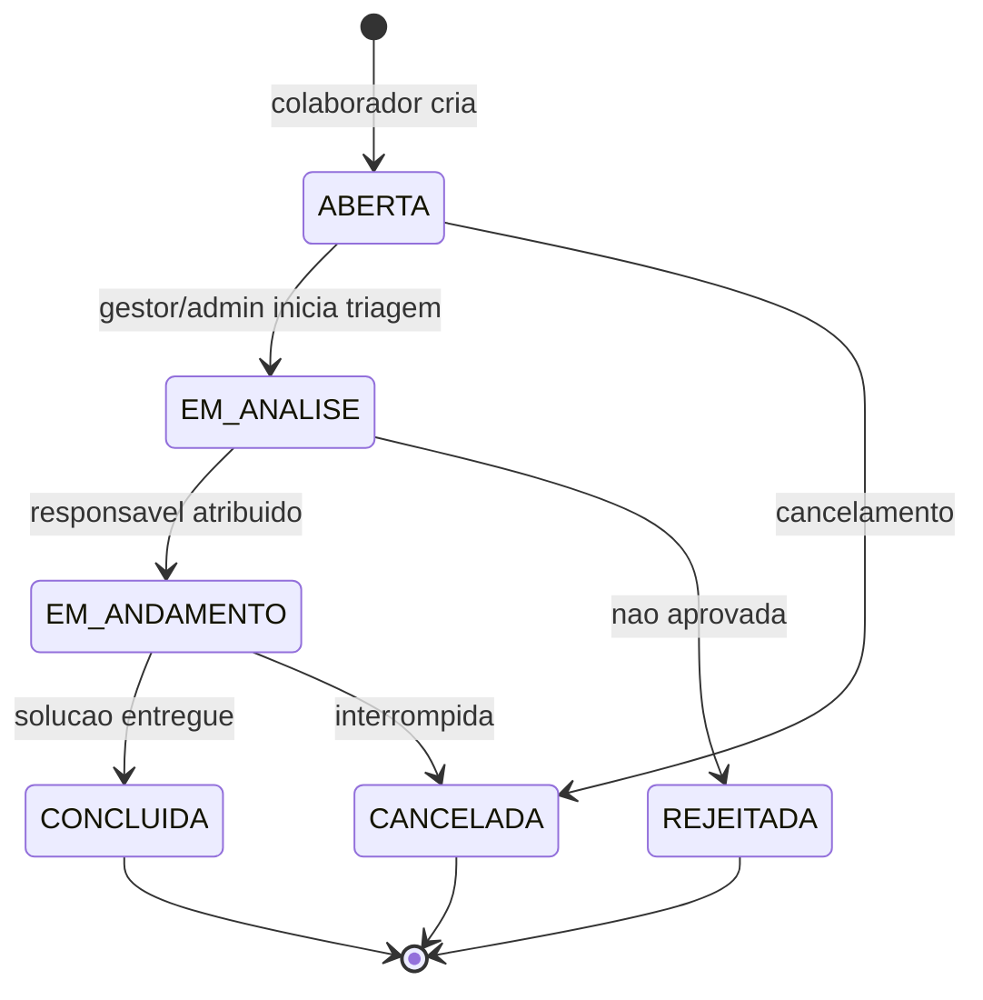

# Manactions

Gerenciador de demandas internas para organizar a comunicacao entre colaboradores, areas responsaveis e gestores. A aplicacao funciona como uma intranet operacional: centraliza areas da empresa, abertura de demandas, triagem, atribuicao de responsaveis, acompanhamento de status, comentarios, processos internos, notificacoes e indicadores em dashboard.

O objetivo do projeto e deixar claro quem precisa resolver cada solicitacao, qual e o andamento, quais regras/processos apoiam aquela area e quais usuarios podem atuar em cada etapa.

## Visao Geral



## O Que a Aplicacao Faz

| Modulo | Para que serve |
| --- | --- |
| Dashboard | Mostra uma visao consolidada das demandas, indicadores e atividades recentes. |
| Areas | Lista areas organizacionais, seus responsaveis, canais de contato, processos e categorias de demanda. |
| Demandas | Permite criar, filtrar, acompanhar, comentar, atribuir e alterar status de solicitacoes internas. |
| Processos | Centraliza documentacao interna por area, com conteudo, tags, versao e publicacao. |
| Usuarios | Gerencia perfis corporativos, papeis e permissoes de atuacao. |
| Notificacoes | Avisa usuarios sobre eventos relevantes, como atribuicoes e atualizacoes. |
| Busca Global | Pesquisa areas, usuarios, demandas e processos em um unico lugar. |
| Admin | Configura dados sensiveis, papeis, areas e permissoes administrativas. |

## Fluxo Principal de Uso



## Arquitetura



## Papeis e Permissoes



## Tecnologias Utilizadas

### Frontend

- React 19 com TypeScript
- Vite
- TanStack Start
- TanStack Router
- TanStack Query
- Tailwind CSS
- Radix UI
- Lucide React
- Motion
- Supabase Auth
- Sonner para notificacoes visuais
- Recharts para graficos
- Zod e React Hook Form para formularios e validacoes

### Backend

- Node.js com TypeScript
- NestJS
- Prisma ORM
- PostgreSQL
- Supabase Auth
- Passport JWT
- Swagger/OpenAPI
- NestJS Terminus para health checks
- NestJS Throttler para rate limit
- Resend para envio de e-mails
- Jest para testes

### Banco de Dados

O modelo principal usa PostgreSQL e Prisma. As entidades centrais sao:



## Jornada de uma Demanda



## Estrutura do Repositorio

```text
Manactions/
|-- frontend/                 # Aplicacao web em React + TanStack Start
|   |-- src/routes/           # Rotas autenticadas, login, dashboard e telas
|   |-- src/components/       # Componentes de UI e componentes da aplicacao
|   |-- src/lib/backend/      # Clientes para consumir a API
|   |-- src/integrations/     # Integracao com Supabase
|   `-- supabase/             # Configuracoes e migracoes auxiliares
|
|-- backend/                  # API NestJS
|   |-- src/auth/             # Autenticacao e usuario atual
|   |-- src/areas/            # Areas, responsaveis e canais
|   |-- src/demandas/         # Demandas, comentarios, status e atribuicao
|   |-- src/processos/        # Processos internos
|   |-- src/notificacoes/     # Notificacoes in-app e templates de e-mail
|   |-- src/busca/            # Busca global
|   |-- src/dashboard/        # Indicadores da home
|   |-- src/usuarios/         # Perfis e papeis
|   `-- prisma/               # Schema, migrations e seed
|
`-- docs/                     # Documentacao complementar do projeto
```

## Como Rodar Localmente

### 1. Backend

```bash
cd backend
npm install
npx prisma generate
npx prisma db push
npm run db:seed
npm run start:dev
```

Por padrao, a API fica disponivel em:

- Base da API: `http://localhost:3000/api`
- Swagger: `http://localhost:3000/api/docs`
- Health check: `http://localhost:3000/api/health`

### 2. Frontend

```bash
cd frontend
npm install
npm run dev
```

O frontend roda via Vite/TanStack Start e consome a API configurada nas variaveis de ambiente.

## Variaveis de Ambiente

<details>
<summary>Backend</summary>

| Variavel | Descricao |
| --- | --- |
| `DATABASE_URL` | Connection string PostgreSQL. |
| `SUPABASE_URL` | URL do projeto Supabase. |
| `SUPABASE_SERVICE_ROLE_KEY` | Chave service role para operacoes administrativas. |
| `SUPABASE_JWT_SECRET` | Segredo JWT do Supabase. |
| `JWT_SECRET` | Segredo usado pelo backend quando aplicavel. |
| `JWT_EXPIRES_IN` | Tempo de expiracao do token interno. |
| `RESEND_API_KEY` | Chave do Resend para envio de e-mails. |
| `FRONTEND_URL` | URL permitida no CORS. |
| `PORT` | Porta da API, geralmente `3000`. |

</details>

<details>
<summary>Frontend</summary>

As variaveis exatas dependem do ambiente configurado, mas a aplicacao usa Supabase no cliente e precisa apontar para a API do backend.

Procure os arquivos de configuracao em:

- `frontend/src/lib/config.server.ts`
- `frontend/src/integrations/supabase/client.ts`
- `frontend/src/integrations/supabase/client.server.ts`

</details>

## Endpoints Principais

| Modulo | Prefixo | Responsabilidade |
| --- | --- | --- |
| Auth | `/api/auth` | Usuario autenticado e sincronizacao de perfil. |
| Areas | `/api/areas` | Areas, responsaveis e canais de contato. |
| Usuarios | `/api/usuarios` | Perfis, papeis e configuracoes de usuario. |
| Demandas | `/api/demandas` | Criacao, filtros, comentarios, atribuicao e status. |
| Processos | `/api/processos` | Documentacao interna por area. |
| Notificacoes | `/api/notificacoes` | Alertas e marcacao como lida. |
| Busca | `/api/busca` | Busca global por termo. |
| Dashboard | `/api/dashboard` | Indicadores consolidados. |
| Health | `/api/health` | Status da API e do banco. |

## Diferenciais do Projeto

- Fluxo completo de demandas, da abertura ate a conclusao.
- Regras de permissao separando ADMIN, GESTOR e COLABORADOR.
- Integracao com Supabase Auth para autenticacao.
- Backend modular em NestJS, com regras de negocio centralizadas em services.
- Prisma como camada de acesso ao banco, com schema claro e migrations.
- Interface moderna com TanStack, Tailwind, Radix UI e componentes reutilizaveis.
- Documentacao interativa da API via Swagger.
- Health check para monitoramento do backend.

## Resumo em Uma Frase

Manactions e uma plataforma full stack para transformar solicitacoes internas em fluxos rastreaveis, com responsaveis definidos, historico, notificacoes, processos de apoio e visao gerencial.
